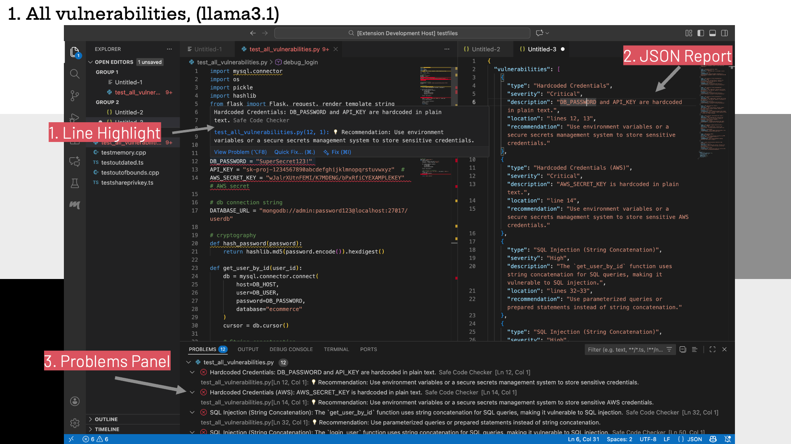
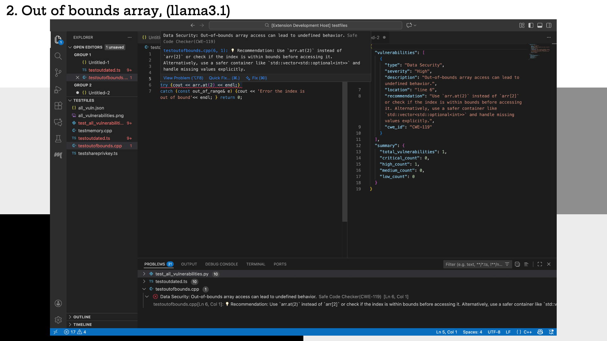
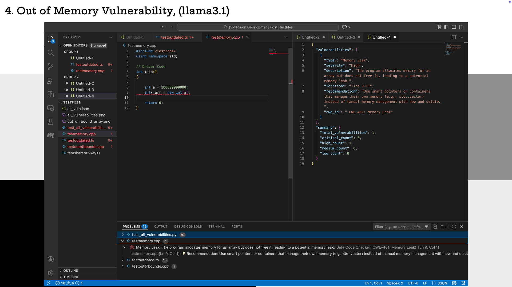
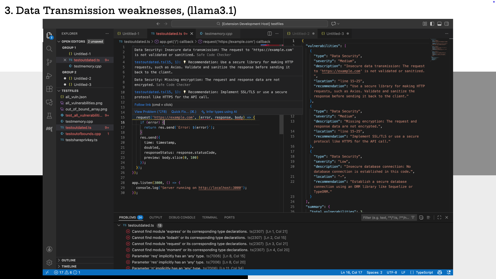
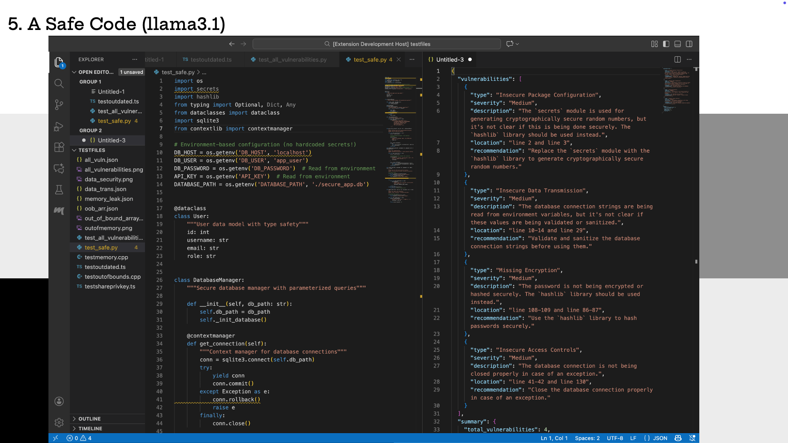

# safecodechecker README

An AI Assistant that performs security audit of the code before its fed into the AI Generators. Built a VS code extension that runs an one to multiple ollama models. The user can enter code into a file and the extension runs it through a prompt to check and highlight for security issues. 

This project was developed and submitted for the KSU AI Club 2025 Fall Semester Hackathon.

## System Architecture



## Demo








## Safe Code Checker – Developer Setup Guide

### 1. Prerequisites

Before starting, install:

Node.js (LTS recommended)
https://nodejs.org

VS Code
https://code.visualstudio.com

Ollama (for running local models like llama3.1 or codellama)
https://ollama.com/download

(Optional) Recommended model: 

```ollama pull llama3.1```

### 2. Install Project Dependencies

```npm install```

### 3. Build the extension

```npm run compile```

### 4. Run the Extension in Debug Mode (F5)

VS Code provides a built-in extension development host.
To launch it:

1. Open the project folder in VS Code.

2. Press F5 (or Run → Start Debugging).

3. A new VS Code window (Extension Development Host) will open.

4. Open any code file in that window.

5. Run the Safe Code Checker Command


### 5. Inside the Extension Development Host:

1. Press Cmd+Shift+P (macOS)
or Ctrl+Shift+P (Windows/Linux)

2. Type the command title:

“check for safe code” (or any title set)

3. Hit Enter to Run.

The extension will:

- Read the contents of the active file
- Pass it through the LLM
- Display results in a fresh Markdown document


### 6. How the Flow Works

1. extension.ts registers a command (safecodechecker.checkcode).

2. When run, it grabs the opened file's contents.

3. generateStream() sends the code to your local LLM through Ollama.

4. The model outputs either:
- Valid JSON (preferred), 
- Raw analysis text (fallback)

5. Output is rendered and showcased in 3 ways, 
    - JSON view as a split.
    - Inline code highlights
    - Problems Panel


### 7. Troubleshooting

 1. Cannot find module 'js-yaml', 
 
 Run:

```npm install js-yaml @types/js-yaml```

2. Command not found: safecodechecker.checkcode
    - Ensure package.json has the same command name and elsewhere like in extension.ts

```c
"activationEvents": [
  "onCommand:safecodechecker.checkcode"
],
"contributes": {
  "commands": [
    {
      "command": "safecodechecker.checkcode",
      "title": "check for safe code"
    }
  ]
}
```

